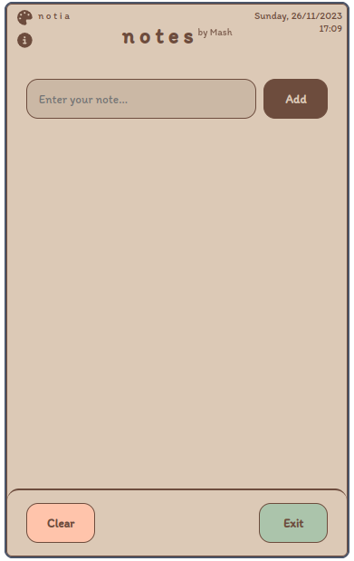
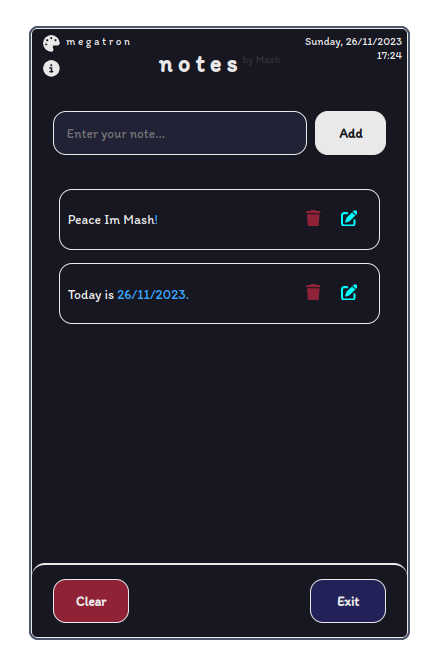
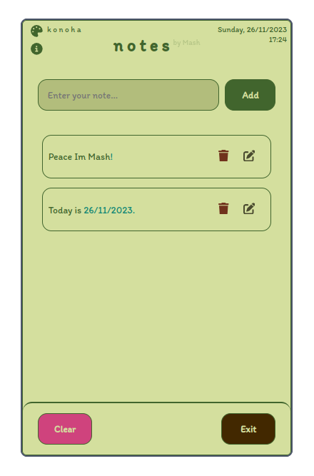
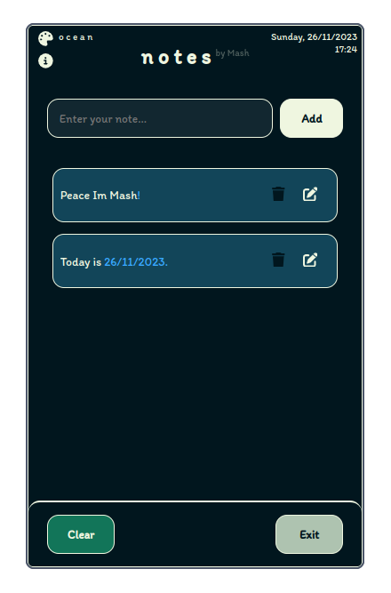
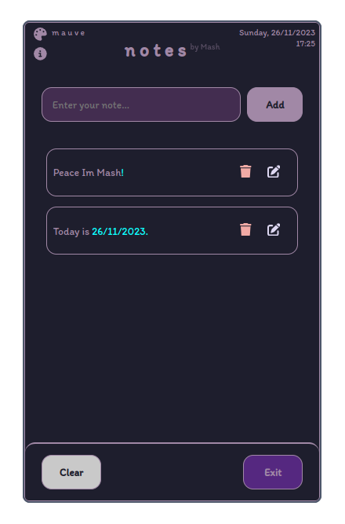

# Awesome Electron Notes App



> A beautiful Electron notes app with themes to keep your thoughts organized.


## Features

- **Beautiful Interface:** A clean and intuitive user interface for a delightful note-taking experience.
- **Themes:** Choose from a variety of themes to personalize your app and make it visually appealing.
- **Offline :** Access and edit your notes even without an internet connection.


## Installation

### Prerequisites

- [Node.js](https://nodejs.org/) installed
- [npm](https://www.npmjs.com/) (Node Package Manager)

### Steps

   ```bash
   git clone https://github.com/Mohamed-Abbas-Homani/Electron-NotesApp.git
   cd Electron-NotesApp
   npm install
   npm start
   ```
## Themes
Change the theme from top left corner.
### notia:

### megatron:

### konoha:

### ocean:

### mauve:

